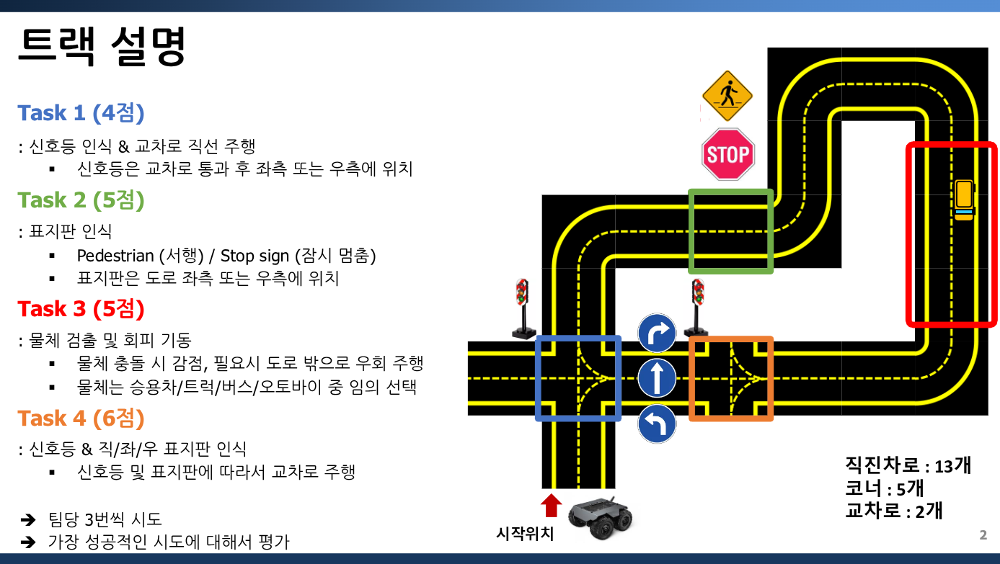
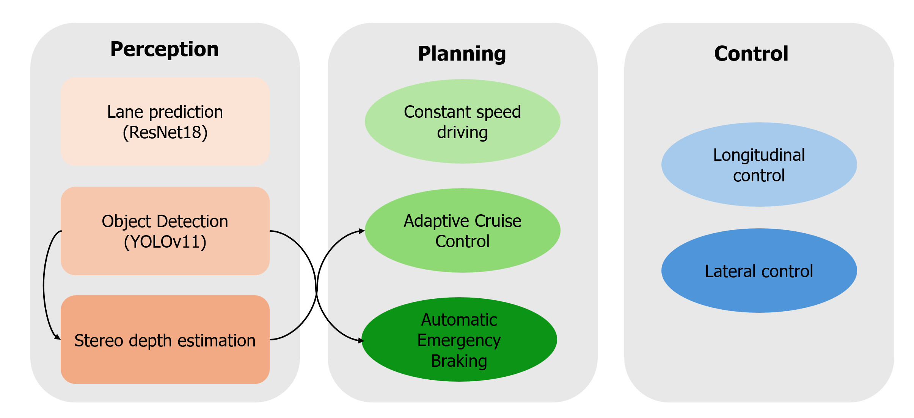

# ECL3003
2025 Embedded System @ Hanyang Univ.

## Team
- [Nayoung Kim](https://github.com/nayoungk1m) - Perception
- [Kyungho Kim](https://github.com/Ue-ueo) - Planning & Control
- [Hoyeon Lee](https://github.com/2ddada) - Planning & Control

## Environment
- **Hardware**
  - NVIDIA Jetson Orin Nano (Developer Kit)
  - Stereo Camera: 2 × JetCam
  - Mobile Platform: [Wave Rover](https://www.waveshare.com/wiki/WAVE_ROVER)

- **Software**
  - OS: Ubuntu 22.04 (Jammy Jellyfish)
  - Python: 3.10.12
  - OpenCV: 4.12.0-dev (with CUDA)
  - TensorRT: 10.3.0.30

# Project 1
## Task description

**Task 1:** Traffic light detection

**Task 2:** Traffic sign detection (Pedestrian / Stop sign)

**Task 3:** Detect and avoid vehicles

**Task 4:** Traffic light & direction sign detection and pass intersections accordingly

## System Architecture
### Perception
- **YOLO**:Detect traffic lights, signs (pedestrian, stop), and vehicles

  → YOLO model was converted from **PyTorch (.pt)** to **ONNX**, then optimized using **TensorRT** to generate a high-performance `.engine` file for real-time inference on Jetson.
- **Alexnet**: Extract the center line of the lane and returns it as a series of waypoints

### Planning
- **Flag Setting**: Based on YOLO detections, sets flags that determine which task logic should be executed (e.g., stop, detour, slow down)
- Determines task-specific behavior (e.g., stop at STOP sign, avoid obstacle) using flags set by the perception module

### Control
- **PID Controller**: Calculates the steering angle based on the error between the target waypoint and the center of the image

---

# Project 2 - Adaptive Cruise Control (ACC)
## Overview
This project is the final project of **ECL3003 Embedded Systems** course.  
Project 2 was an open-topic assignment, and we chose to implement a simplified **ADAS (Advanced Driver-Assistance System)** function — **Adaptive Cruise Control (ACC)**.

- **Stereo depth estimation**  
- **Adaptive Cruise Control (ACC)**  
- **Autonomous Emergency Braking (AEB)**  
- **PI-based motion control**

## System Architecture

### Perception
- **Object Detection (YOLO)**: Detect vehicles in the front

  → The YOLO model was converted from **.pt → .onnx → TensorRT engine**, allowing efficient inference on Jetson Orin Nano using the `.engine` file.
- **Stereo Depth Estimation**: Using the disparity between stereo images, calculate **depth** of the detected vehicle in real-time
- **ResNet18**: Extract the center line of the lane and returns it as a series of waypoints

  → ResNet18 was chosen over Alexㅜet due to its **better generalization performance**, allowing more robust lane feature extraction in various road conditions.

### Planning
- **Adaptive Cruise Control (ACC)**: Maintain a safe following distance using the following formula:
$$Target\ distance = default\ distance + 0.3 × current\ speed$$
- **Autonomous Emergency Braking (AEB)**: Execute **emergency stop** if front vehicle is too close

### Control
- **Lateral PI Control**:  
  Control the steering angle to minimize the lateral error between the **waypoint** and the **center of the image**.  
  The resulting steering command is used to **differentially control** the left and right motor throttles.

- **Longitudinal PI Control**:  
  Regulate the vehicle's speed to minimize the error between the **target distance** (from ACC) and the **estimated depth** (from stereo vision)
  The throttle output ensures smooth acceleration or deceleration based on the distance error
